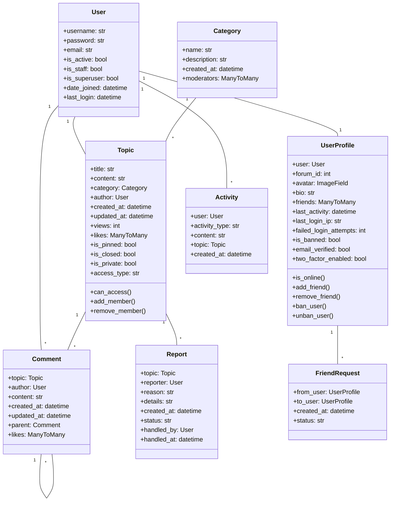

```mermaid
classDiagram
    class User {
        +username: str
        +password: str
        +email: str
        +is_active: bool
        +is_staff: bool
        +is_superuser: bool
        +date_joined: datetime
        +last_login: datetime
    }

    class UserProfile {
        +user: User
        +forum_id: int
        +avatar: ImageField
        +bio: str
        +friends: ManyToMany
        +last_activity: datetime
        +last_login_ip: str
        +failed_login_attempts: int
        +is_banned: bool
        +email_verified: bool
        +two_factor_enabled: bool
        +is_online()
        +add_friend()
        +remove_friend()
        +ban_user()
        +unban_user()
    }

    class Category {
        +name: str
        +description: str
        +created_at: datetime
        +moderators: ManyToMany
    }

    class Topic {
        +title: str
        +content: str
        +category: Category
        +author: User
        +created_at: datetime
        +updated_at: datetime
        +views: int
        +likes: ManyToMany
        +is_pinned: bool
        +is_closed: bool
        +is_private: bool
        +access_type: str
        +can_access()
        +add_member()
        +remove_member()
    }

    class Comment {
        +topic: Topic
        +author: User
        +content: str
        +created_at: datetime
        +updated_at: datetime
        +parent: Comment
        +likes: ManyToMany
    }

    class Activity {
        +user: User
        +activity_type: str
        +content: str
        +topic: Topic
        +created_at: datetime
    }

    class Report {
        +topic: Topic
        +reporter: User
        +reason: str
        +details: str
        +created_at: datetime
        +status: str
        +handled_by: User
        +handled_at: datetime
    }

    class FriendRequest {
        +from_user: UserProfile
        +to_user: UserProfile
        +created_at: datetime
        +status: str
    }

    User "1" -- "1" UserProfile
    UserProfile "1" -- "*" FriendRequest
    User "1" -- "*" Topic
    User "1" -- "*" Comment
    User "1" -- "*" Activity
    Category "1" -- "*" Topic
    Topic "1" -- "*" Comment
    Topic "1" -- "*" Report
    Comment "1" -- "*" Comment
```
