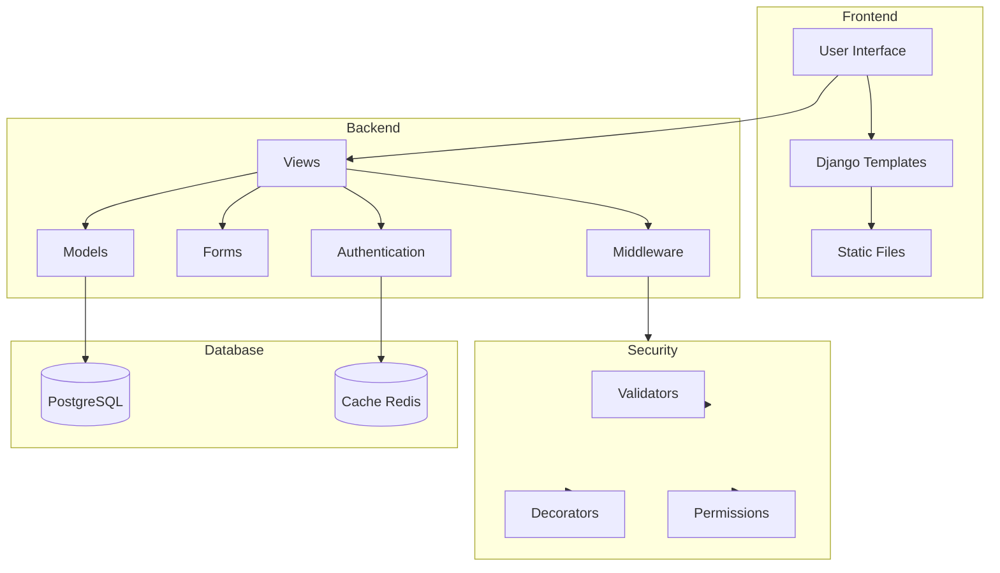

```mermaid
graph TB
    subgraph Frontend
        UI[User Interface]
        Templates[Django Templates]
        Static[Static Files]
    end

    subgraph Backend
        Views[Views]
        Models[Models]
        Forms[Forms]
        Auth[Authentication]
        Middleware[Middleware]
    end

    subgraph Security
        Validators[Validators]
        Decorators[Decorators]
        Permissions[Permissions]
    end

    subgraph Database
        PostgreSQL[(PostgreSQL)]
        Cache[(Cache Redis)]
    end

    UI --> Templates
    Templates --> Static
    UI --> Views
    Views --> Models
    Views --> Forms
    Views --> Auth
    Models --> PostgreSQL
    Auth --> Cache
    Views --> Middleware
    Middleware --> Security
    Security --> Validators
    Security --> Decorators
    Security --> Permissions
```
