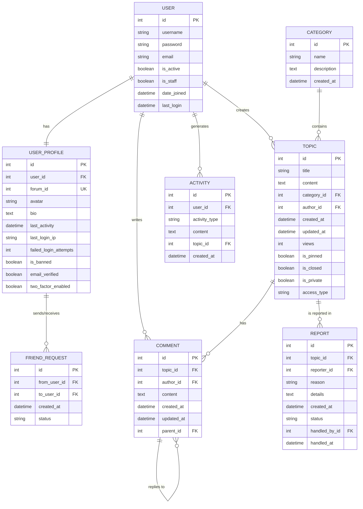

```mermaid
erDiagram
    USER ||--|| USER_PROFILE : has
    USER_PROFILE ||--o{ FRIEND_REQUEST : "sends/receives"
    USER ||--o{ TOPIC : creates
    USER ||--o{ COMMENT : writes
    USER ||--o{ ACTIVITY : generates
    CATEGORY ||--o{ TOPIC : contains
    TOPIC ||--o{ COMMENT : has
    TOPIC ||--o{ REPORT : "is reported in"
    COMMENT ||--o{ COMMENT : "replies to"

    USER {
        int id PK
        string username
        string password
        string email
        boolean is_active
        boolean is_staff
        datetime date_joined
        datetime last_login
    }

    USER_PROFILE {
        int id PK
        int user_id FK
        int forum_id UK
        string avatar
        text bio
        datetime last_activity
        string last_login_ip
        int failed_login_attempts
        boolean is_banned
        boolean email_verified
        boolean two_factor_enabled
    }

    CATEGORY {
        int id PK
        string name
        text description
        datetime created_at
    }

    TOPIC {
        int id PK
        string title
        text content
        int category_id FK
        int author_id FK
        datetime created_at
        datetime updated_at
        int views
        boolean is_pinned
        boolean is_closed
        boolean is_private
        string access_type
    }

    COMMENT {
        int id PK
        int topic_id FK
        int author_id FK
        text content
        datetime created_at
        datetime updated_at
        int parent_id FK
    }

    ACTIVITY {
        int id PK
        int user_id FK
        string activity_type
        text content
        int topic_id FK
        datetime created_at
    }

    REPORT {
        int id PK
        int topic_id FK
        int reporter_id FK
        string reason
        text details
        datetime created_at
        string status
        int handled_by_id FK
        datetime handled_at
    }

    FRIEND_REQUEST {
        int id PK
        int from_user_id FK
        int to_user_id FK
        datetime created_at
        string status
    }
```
