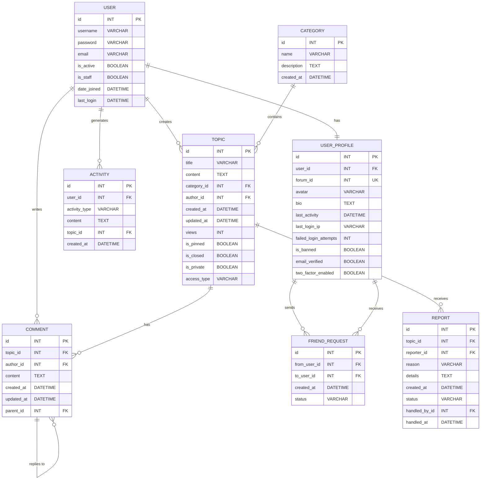

```mermaid
erDiagram
    USER ||--o{ TOPIC : creates
    USER ||--o{ COMMENT : writes
    USER ||--o{ ACTIVITY : generates
    USER ||--|| USER_PROFILE : has
    USER_PROFILE ||--o{ FRIEND_REQUEST : sends
    USER_PROFILE ||--o{ FRIEND_REQUEST : receives
    CATEGORY ||--o{ TOPIC : contains
    TOPIC ||--o{ COMMENT : has
    TOPIC ||--o{ REPORT : receives
    COMMENT ||--o{ COMMENT : "replies to"

    USER {
        id INT PK
        username VARCHAR
        password VARCHAR
        email VARCHAR
        is_active BOOLEAN
        is_staff BOOLEAN
        date_joined DATETIME
        last_login DATETIME
    }

    USER_PROFILE {
        id INT PK
        user_id INT FK
        forum_id INT UK
        avatar VARCHAR
        bio TEXT
        last_activity DATETIME
        last_login_ip VARCHAR
        failed_login_attempts INT
        is_banned BOOLEAN
        email_verified BOOLEAN
        two_factor_enabled BOOLEAN
    }

    CATEGORY {
        id INT PK
        name VARCHAR
        description TEXT
        created_at DATETIME
    }

    TOPIC {
        id INT PK
        title VARCHAR
        content TEXT
        category_id INT FK
        author_id INT FK
        created_at DATETIME
        updated_at DATETIME
        views INT
        is_pinned BOOLEAN
        is_closed BOOLEAN
        is_private BOOLEAN
        access_type VARCHAR
    }

    COMMENT {
        id INT PK
        topic_id INT FK
        author_id INT FK
        content TEXT
        created_at DATETIME
        updated_at DATETIME
        parent_id INT FK
    }

    ACTIVITY {
        id INT PK
        user_id INT FK
        activity_type VARCHAR
        content TEXT
        topic_id INT FK
        created_at DATETIME
    }

    REPORT {
        id INT PK
        topic_id INT FK
        reporter_id INT FK
        reason VARCHAR
        details TEXT
        created_at DATETIME
        status VARCHAR
        handled_by_id INT FK
        handled_at DATETIME
    }

    FRIEND_REQUEST {
        id INT PK
        from_user_id INT FK
        to_user_id INT FK
        created_at DATETIME
        status VARCHAR
    }
```
