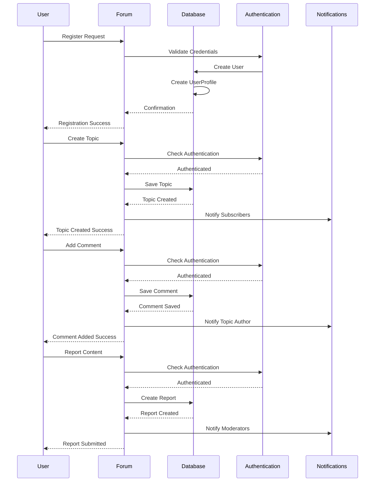

```mermaid
sequenceDiagram
    participant U as User
    participant F as Forum
    participant DB as Database
    participant A as Authentication
    participant N as Notifications

    %% Inscription
    U->>F: Register Request
    F->>A: Validate Credentials
    A->>DB: Create User
    DB->>DB: Create UserProfile
    DB-->>F: Confirmation
    F-->>U: Registration Success

    %% Création d'un sujet
    U->>F: Create Topic
    F->>A: Check Authentication
    A-->>F: Authenticated
    F->>DB: Save Topic
    DB-->>F: Topic Created
    F->>N: Notify Subscribers
    F-->>U: Topic Created Success

    %% Commentaire
    U->>F: Add Comment
    F->>A: Check Authentication
    A-->>F: Authenticated
    F->>DB: Save Comment
    DB-->>F: Comment Saved
    F->>N: Notify Topic Author
    F-->>U: Comment Added Success

    %% Modération
    U->>F: Report Content
    F->>A: Check Authentication
    A-->>F: Authenticated
    F->>DB: Create Report
    DB-->>F: Report Created
    F->>N: Notify Moderators
    F-->>U: Report Submitted
```
