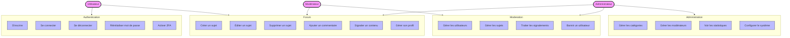

```mermaid
flowchart TB
    %% Acteurs
    User(["Utilisateur"])
    Mod(["Modérateur"])
    Admin(["Administrateur"])

    %% Cas d'utilisation - Authentication
    subgraph Authentication
        direction TB
        Auth1[S'inscrire]
        Auth2[Se connecter]
        Auth3[Se déconnecter]
        Auth4[Réinitialiser mot de passe]
        Auth5[Activer 2FA]
    end

    %% Cas d'utilisation - Gestion du Forum
    subgraph Forum
        direction TB
        Forum1[Créer un sujet]
        Forum2[Éditer un sujet]
        Forum3[Supprimer un sujet]
        Forum4[Ajouter un commentaire]
        Forum5[Signaler un contenu]
        Forum6[Gérer son profil]
    end

    %% Cas d'utilisation - Modération
    subgraph Moderation
        direction TB
        Mod1[Gérer les utilisateurs]
        Mod2[Gérer les sujets]
        Mod3[Traiter les signalements]
        Mod4[Bannir un utilisateur]
    end

    %% Cas d'utilisation - Administration
    subgraph Administration
        direction TB
        Admin1[Gérer les catégories]
        Admin2[Gérer les modérateurs]
        Admin3[Voir les statistiques]
        Admin4[Configurer le système]
    end

    %% Relations
    User --> Authentication
    User --> Forum
    
    Mod --> Forum
    Mod --> Moderation
    
    Admin --> Forum
    Admin --> Moderation
    Admin --> Administration

    %% Styles
    classDef actor fill:#f9f,stroke:#333,stroke-width:2px
    class User,Mod,Admin actor
    
    classDef usecase fill:#bbf,stroke:#333,stroke-width:1px
    class Auth1,Auth2,Auth3,Auth4,Auth5,Forum1,Forum2,Forum3,Forum4,Forum5,Forum6,Mod1,Mod2,Mod3,Mod4,Admin1,Admin2,Admin3,Admin4 usecase
```
